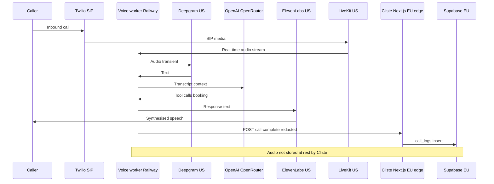

# GDPR, ePrivacy & AI Act — Cliste voice agents in Ireland

**Status:** Internal compliance reference (engineering + product).  
**Last updated:** 31 May 2026.  
**Audience:** Cliste team, salon customers (operators), and technical reviewers.

> **This document is not legal advice.** Irish and EU data-protection law is fact-specific. Use this as a map of how Cliste is designed, what the codebase does today, and where professional review is still required. For binding commitments, rely on `/legal/privacy`, `docs/legal/DPA.md`, and signed customer agreements.

---

## Table of contents

1. [Regulatory landscape (Ireland)](#1-regulatory-landscape-ireland)
2. [Who is controller vs processor](#2-who-is-controller-vs-processor)
3. [What you can do](#3-what-you-can-do-lawful-processing-for-cliste)
4. [What you cannot do (or must not without extra safeguards)](#4-what-you-cannot-do-or-must-not-without-extra-safeguards)
5. [Lawful bases for AI voice calls](#5-lawful-bases-for-ai-voice-calls)
6. [EU AI Act & transparency](#6-eu-ai-act--transparency)
7. [International transfers](#7-international-transfers)
8. [Data subject rights & retention](#8-data-subject-rights--retention)
9. [Codebase audit (May 2026)](#9-codebase-audit-may-2026)
10. [Salon (controller) checklist](#10-salon-controller-checklist)
11. [Recommended engineering actions](#11-recommended-engineering-actions)
12. [References](#12-references)

---

## 1. Regulatory landscape (Ireland)

| Instrument | What it governs for Cliste |
| ---------- | --------------------------- |
| **GDPR** ([Regulation (EU) 2016/679](https://eur-lex.europa.eu/legal-content/EN/TXT/?uri=CELEX%3A32016R0679)) | All processing of personal data (caller phone numbers, names, transcripts, appointments, salon accounts). |
| **Data Protection Act 2018** (Ireland) | National implementation; sets out DPC powers, offences, and some national derogations. |
| **ePrivacy Regulations** ([S.I. No. 336/2011](https://www.irishstatutebook.ie/eli/2011/si/336/)) | **Direct marketing** by phone/SMS/email; stricter rules than GDPR alone for unsolicited contact. Not the same as “GDPR consent” for booking. |
| **EU AI Act** ([Regulation (EU) 2024/1689](https://eur-lex.europa.eu/legal-content/EN/TXT/?uri=CELEX%3A32024R1689)) | **Transparency** for AI systems interacting with natural persons (Article 50). Key deadline for many deployers: **2 August 2026**. |
| **Interception of Postal Packets and Telecommunications Messages (Regulation) Act 1993** | Whether **recording/intercepting** a call is a criminal interception issue. Ireland often allows **single-party consent** to record if you are a party to the call — but **GDPR still applies** to what you do with the recording afterwards (purpose, transparency, retention). |

**Supervisory authority:** [Data Protection Commission (DPC)](https://www.dataprotection.ie) — Ireland’s lead authority for GDPR and ePrivacy enforcement.

**DPC & AI:** The DPC has published guidance on AI and fundamental rights; automated telephone systems in sensitive sectors (e.g. healthcare) attract higher scrutiny. Hair/beauty salons are lower risk than healthcare, but **voice + AI + transcripts** still warrant a DPIA (Cliste has one at `docs/legal/DPIA.md`).

---

## 2. Who is controller vs processor

This matches the public privacy notice and `docs/legal/DPA.md`.

| Relationship | Controller | Processor | Typical data |
| ------------ | ---------- | --------- | ------------ |
| **Salon ↔ caller/customer** | **Salon** | **Cliste** | Name, phone, booking, call transcripts, AI summaries |
| **Cliste ↔ salon owner** | **Cliste** | Sub-processors (Stripe, Supabase, etc.) | Account email, billing, dashboard activity |

**Implication:** Most “can we do X with a caller’s data?” questions must be answered **by the salon** as controller (lawful basis, transparency to callers, marketing). Cliste implements **processor** obligations: process only on instructions, assist with rights, secure processing, sub-processor transparency, breach notification to controller.

---

## 3. What you can do (lawful processing for Cliste)

When the salon has a valid **Article 6** basis (usually **contract** or **legitimate interests** for answering inbound booking calls), Cliste **can**:

| Activity | How Cliste supports it |
| -------- | ---------------------- |
| Answer **inbound** calls with an AI agent on the salon’s published number | Voice worker + `POST /api/voice/call-complete` → `call_logs` |
| Stream audio to STT/LLM/TTS **without retaining audio at rest** | Documented in DPA, DPIA, privacy notice; worker must disable Twilio/LiveKit recording |
| Store **caller ID**, duration, outcome, **redacted** transcript (≤30 days), AI summary (≤13 months) | `src/lib/transcript-redaction.ts`, `src/app/api/cron/data-retention/route.ts` |
| Create/update appointments initiated by the agent | `appointments` with `source = ai_call` |
| Send **transactional** SMS/email (confirmations, reminders, pay links) | Twilio / SendGrid — terms prohibit using Cliste for bulk marketing |
| Transfer data to **US sub-processors** with **DPF and/or SCCs** | Listed at `/legal/sub-processors` |
| **Anonymise** a customer on erasure while keeping appointment **time/price** for Revenue | `eraseCustomerData` in `src/app/(dashboard)/dashboard/privacy/actions.ts` |
| Provide salons **Article 15 export** and **Article 17 erasure** tools | `/dashboard/privacy` (RLS-scoped export; admin-scoped erasure) |
| Log GDPR exports/erasures in `security_auth_events` | `gdpr_data_export`, `gdpr_erasure` event types |
| Isolate tenants (RLS, resolve org from `called_number` not body `organization_id`) | `src/app/api/voice/call-complete/route.ts` |
| Run security/rate-limit processing with **legitimate interest** | OTP/rate tables + cron purge; see ROPA §2.3 |
| Operate with **no mandatory DPO** at current scale | ROPA notes Art 37 threshold not met; privacy lead as DPC contact |
| Disclose AI nature to callers at start of call | Required by EU AI Act Art 50; documented in privacy notice & terms — **must be enforced in voice worker prompts** (outside this repo) |

---

## 4. What you cannot do (or must not without extra safeguards)

### 4.1 Absolute or near-absolute prohibitions

| You must not… | Why |
| ------------- | --- |
| Process customer data **outside salon instructions** or for Cliste’s unrelated purposes (e.g. selling data, training public models on identifiable call content without basis) | GDPR Art 28 — processor scope |
| **Cross-tenant** read/write customer data | GDPR integrity/confidentiality; codebase rejects org/called_number mismatch on voice webhook |
| Rely on **“HIPAA compliant”** vendor marketing as proof of GDPR compliance | US healthcare regime ≠ GDPR |
| **Outbound cold-call marketing** to Irish **mobile** numbers without prior consent | ePrivacy Reg 13(6); DPC FAQ on mobile marketing |
| Use Cliste to send **unsolicited marketing** SMS/email | Terms §4 — transactional only |
| **Record and store call audio** long-term without a clear lawful basis and transparency | GDPR storage limitation + purpose limitation; DPIA assumes audio **not** stored |
| **Solicit** payment card numbers or PPSN on calls and store them in transcripts | PCI + special-category risk; redaction is backup only |
| **Hide** that the callee is speaking to an AI (after Aug 2026 Art 50 applies) | EU AI Act transparency |
| Transfer personal data to third countries **without** a valid transfer tool (SCCs, DPF, etc.) | GDPR Chapter V |

### 4.2 Allowed only with extra conditions

| Activity | Condition |
| -------- | --------- |
| Process **special category** data (health, allergies, pregnancy mentioned on call) | Salon needs **Art 9** condition; Cliste should **minimise** and **not solicit**; 30-day transcript TTL limits exposure |
| **Solely automated** decisions with **legal or similarly significant** effects | Art 22 — booking a haircut is usually **not** “similarly significant”; credit, employment, healthcare triage would be. If solely automated **and** significant, need Art 22(2) exception + human intervention rights |
| **Profiling** callers across salons | Cliste architecture isolates by `organization_id`; must not build cross-salon caller profiles |
| **Outbound AI voice campaigns** | ePrivacy + GDPR marketing rules; separate opt-in for mobiles; identify caller per Reg 13(10) |
| **Biometric voiceprints** for identification | Often **special category** under GDPR; explicit consent + DPIA — **not** part of Cliste product design |
| Keep transcripts **indefinitely** | Violates Art 5(1)(e); cron nulls at 30 days |
| **Public** disclosure of call transcripts | Salon staff only via dashboard; no public URLs for transcripts |
| Use **legacy** `organization_id`-only voice webhook without `called_number` | Cross-tenant risk if secret leaks — disable `CLISTE_VOICE_ALLOW_LEGACY_ORG_ID` after rollout |

### 4.3 Salon (controller) responsibilities Cliste cannot substitute

| Salon must… |
| ----------- |
| Tell callers they are dealing with an **AI** and how data is used (privacy notice on website, in-salon signage, verbal policy) |
| Have a **lawful basis** for answering calls and storing bookings |
| Honour **data subject requests** (can use `/dashboard/privacy` tools) |
| Not use exported phone lists for **spam marketing** |
| Avoid uploading **unnecessary special-category** data in business files / FAQs |

---

## 5. Lawful bases for AI voice calls

For **inbound** booking calls, the salon (controller) typically relies on:

| Basis | Art 6(1) | When it fits |
| ----- | -------- | ------------- |
| **Contract** | (b) | Caller wants an appointment; processing is necessary to take booking steps at their request |
| **Legitimate interests** | (f) | Answering the salon’s published business line; balancing test: salon interest vs caller expectation when dialling a business |
| **Consent** | (a) | Rare for core booking; may be needed for **optional** extras (marketing follow-up, non-essential recording beyond what’s disclosed) |

**Not usually applicable for standard salon booking:** consent as the *only* basis for answering a call the customer initiated to the salon’s number.

**ePrivacy vs GDPR:** Reg 13 governs **unsolicited direct marketing** calls. An **inbound** customer calling the salon is **not** the same as Cliste placing unsolicited marketing calls. Outbound reminders SMS are **transactional** if tied to an existing booking relationship.

**Article 22 (automated decisions):** Cliste’s position (see `docs/legal/DPIA.md` and `/legal/privacy` §7): the agent facilitates bookings like a receptionist; salons can review/cancel; no solely automated decision with legal or similarly significant effect **for typical appointment booking**. Re-evaluate if you add credit scoring, automated refusal of service, or health triage.

---

## 6. EU AI Act & transparency

| Topic | Requirement | Cliste position |
| ----- | ------------- | --------------- |
| **Article 50** | Inform people they interact with an AI, clearly and in a timely manner | Privacy notice §8; terms §6; **worker must speak disclosure on first turn** |
| **Deadline** | Commission timeline: Art 50 transparency rules apply from **2 August 2026** | Track in release planning |
| **Risk tier** | Most customer-service voice agents = **limited risk** (transparency), not high-risk | Unless you enter hiring, credit, law enforcement, etc. |
| **GDPR linkage** | AI Act evidence should connect to DPIA, ROPA, sub-processors | `docs/legal/DPIA.md`, `docs/legal/ROPA.md` |

**Cannot:** bury AI disclosure only in a website privacy policy the caller never sees **at call time** — in-call disclosure is required for deployers under Art 50.

---

## 7. International transfers

Cliste uses EU hosting (Supabase) but several **voice AI stack** vendors process in the **US** (LiveKit, Deepgram, ElevenLabs, OpenAI, Railway worker hosting, etc.).

| Mechanism | Use when |
| --------- | -------- |
| **EU–US Data Privacy Framework** | Sub-processor certified |
| **Standard Contractual Clauses (2021 modules)** | No DPF; processor-to-processor chain documented |
| **Supplementary measures** | TLS, no audio retention, transcript redaction, short TTL — see DPA Annex II |

**Cannot:** assume “EU entity” (e.g. OpenAI Ireland Ltd) means **all** processing stays in EEA — check each sub-processor row in `/legal/sub-processors`.

---

## 8. Data subject rights & retention

| Right | Article | Implementation in Cliste |
| ----- | ------- | ------------------------- |
| Access | 15 | `/dashboard/privacy` → `exportCustomerData` (JSON download) |
| Erasure | 17 | `/dashboard/privacy` → `eraseCustomerData` (anonymise PII; keep tax fields) |
| Rectification | 16 | Dashboard bookings/contacts (salon-operated) |
| Portability | 20 | JSON export partially covers; DPIA notes dedicated Art 20 UI **not yet built** |
| Restrict / object | 18 / 21 | Manual via privacy@clistesystems.ie |
| Complain to DPC | — | Linked from `/legal/privacy` |

**Retention (operational):** `docs/legal/RETENTION.md` and cron `src/app/api/cron/data-retention/route.ts`

| Asset | TTL |
| ----- | --- |
| Voice audio at rest | **Not stored** |
| `call_logs.transcript`, `transcript_review` | **30 days** → nulled |
| `call_logs.ai_summary`, `caller_number` | **13 months** → nulled |
| Appointments after erasure | Anonymised identity; time/price kept (**~6 years** tax — align public copy) |
| OTP challenges | **30 minutes** |
| Rate-limit events | **14 days** |
| Security audit log | **2 years** |
| Backups | **~35 days** PITR window after deletion |

**Known copy inconsistency:** `/legal/privacy` §11 says appointments retained “7 years” in one row; `RETENTION.md` and erasure comments say **6 years (Revenue)**. Align public and internal docs.

---

## 9. Codebase audit (May 2026)

### 9.1 Legal & policy artefacts (strong)

| Asset | Path |
| ----- | ---- |
| Privacy notice (public) | `src/app/legal/privacy/page.tsx` |
| Terms + processor acceptance | `src/app/legal/terms/page.tsx` |
| Cookie policy + banner | `src/app/legal/cookies/page.tsx`, `src/components/cookie-notice-banner.tsx` |
| Sub-processors | `src/app/legal/sub-processors/page.tsx` |
| DPA, ROPA, DPIA, retention, breach runbook | `docs/legal/*.md` |
| Voice integration contract | `docs/VOICE-WORKER-CONTRACT.md` |
| Security disclosure | `SECURITY.md` |

### 9.2 Technical controls (implemented)

| Control | Location |
| ------- | -------- |
| Transcript redaction (PAN/Luhn, IBAN, PPSN, CVV, DOB phrases) | `src/lib/transcript-redaction.ts` → used in `call-complete` |
| Daily retention cron | `src/app/api/cron/data-retention/route.ts`, `vercel.json` cron `45 3 * * *` |
| GDPR export (RLS-scoped) | `src/app/(dashboard)/dashboard/privacy/actions.ts` |
| GDPR erasure (admin client, org-scoped) | Same file |
| Security audit events | `src/lib/security-events.ts` |
| Voice webhook tenant binding | `src/app/api/voice/call-complete/route.ts` |
| Timing-safe cron/webhook secrets | `src/lib/timing-safe-equal.ts` |
| RLS on tenant tables | Supabase migrations (e.g. `001_initial_schema.sql`, `039_business_files.sql`) |
| CSP / security headers | `next.config.ts`, `middleware.ts` |

### 9.3 Gaps & risks (prioritised)

| Priority | Gap | Risk | Suggested fix |
| -------- | --- | ---- | ------------- |
| **P0** | AI **disclosure** lives in voice worker (Railway), not verified in this repo | EU AI Act / transparency failure | Enforce first-turn script in worker; add monitoring/logging |
| **P0** | Confirm **Twilio/LiveKit recording OFF** on all DIDs | Unlawful retention / interception perception | DPIA checklist item — operational verification |
| **P1** | `/dashboard/privacy` **not in sidebar** (`dashboard-routes.ts`, `dashboard-sidebar.tsx`) | Salons cannot find Art 15/17 tools | Add nav link under Settings or Account |
| **P1** | `exportCustomerData` **omits** `transcript` / `transcript_review` fields | Incomplete Art 15 access | Extend `.select()` to include transcripts while still within retention |
| **P1** | No automated **email** to salon admins on sub-processor changes | DPA §7 commitment | Notify on deploy when `SUBS` list changes |
| **P2** | Art **20** portability UI outstanding | DPIA action item | CSV/JSON bulk export per customer |
| **P2** | `CLISTE_VOICE_ALLOW_LEGACY_ORG_ID` legacy path | Cross-tenant write if secret leaked | Remove flag after worker rollout |
| **P2** | `business_files` / `extracted_text` may contain PII uploaded by salon | Processor stores whatever controller uploads | Salon guidance in Cara Setup UI; optional scan/redaction |
| **P3** | Retention **7 vs 6 years** wording mismatch | Transparency accuracy | Single source of truth in privacy page |
| **P3** | Erasure phone sentinel `+000000000000` shared across subjects | Theoretical collision on re-lookup | Per-row random sentinel or hash |
| **P3** | Cookie policy still mentions “public booking form” while product may have shifted | Stale transparency | Update cookies copy to match live surfaces |

### 9.4 Data flows (voice call)

---

## 10. Salon (controller) checklist

Before going live with the AI line, the salon should confirm:

- [ ] Privacy notice (or leaflet) mentions **AI phone answering**, categories of data, retention, and sub-processors (or link to Cliste’s sub-processor page).
- [ ] Lawful basis documented (usually contract / legitimate interests for inbound booking).
- [ ] Staff know how to run **export** and **erasure** at `/dashboard/privacy`.
- [ ] **No marketing** use of caller lists via Cliste SMS/voice.
- [ ] Published number routes to Cliste DID; callers expect automated handling.
- [ ] Optional: signage — “Calls may be handled by our AI assistant [name].”
- [ ] If callers may discuss health/skin conditions, consider whether Art 9 applies and minimise what staff re-type into notes.

---

## 11. Recommended engineering actions

Short-term (compliance hygiene):

1. Add **Privacy tools** to dashboard navigation → `/dashboard/privacy`.
2. Include **transcripts** in GDPR export when present.
3. Remove **legacy org-id-only** voice webhook path after worker upgrade.
4. Reconcile **6 vs 7 year** appointment retention in public privacy table.
5. Close DPIA checklist: Twilio recording audit, worker AI disclosure test call.

Medium-term:

6. Sub-processor change **email notification** job.
7. Art **20** structured export (appointments + calls in machine-readable bundle).
8. Salon-facing **“caller privacy”** snippet generator (Art 13 helper text) in Cara Setup.

---

## 12. References

### Primary law & regulators

- [GDPR (EUR-Lex)](https://eur-lex.europa.eu/legal-content/EN/TXT/?uri=CELEX%3A32016R0679)
- [Data Protection Act 2018 (Irish Statute Book)](https://www.irishstatutebook.ie/eli/2018/act/7/enacted/en/html)
- [ePrivacy Regulations S.I. 336/2011](https://www.irishstatutebook.ie/eli/2011/si/336/)
- [EU AI Act (EUR-Lex)](https://eur-lex.europa.eu/legal-content/EN/TXT/?uri=CELEX%3A32024R1689)
- [Data Protection Commission — Ireland](https://www.dataprotection.ie)
- [DPC — Direct marketing FAQ (mobile calls)](https://www.dataprotection.ie/en/faqs/direct-marketing/can-my-mobile-phone-be-targeted-marketing-phone-calls)

### Cliste internal docs

- `docs/legal/DPA.md`
- `docs/legal/ROPA.md`
- `docs/legal/DPIA.md`
- `docs/legal/RETENTION.md`
- `docs/legal/BREACH-RUNBOOK.md`
- `docs/VOICE-WORKER-CONTRACT.md`
- Public: `https://app.clistesystems.ie/legal/privacy` (and `/legal/sub-processors`, `/legal/cookies`, `/legal/terms`)

### Guidance (secondary)

- EDPB Guidelines on Article 22 / automated decision-making (WP251, adopted 2018)
- European Commission AI Act implementation timeline (Art 50 from 2 August 2026)
- McCann FitzGerald — [Direct marketing Q&A: Ireland](https://www.mccannfitzgerald.com/uploads/Direct_marketing_QAndA_Ireland.pdf) (ePrivacy Reg 13)

---

## Document history

| Date | Change |
| ---- | ------ |
| 2026-05-31 | Initial research doc: regulatory synthesis + full codebase GDPR audit |
